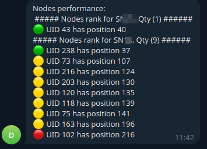

# bittensor_info_bot

Bot shows information about your neurons in bittensor's subnets in telegram.

## Installation

```
git clone https://github.com/dzan-lab/bittensor_info_bot.git  
cd bittensor_info_bot
cp .env.sample .env
nano .env # Fill in your credentials
docker-compose up -d
```
